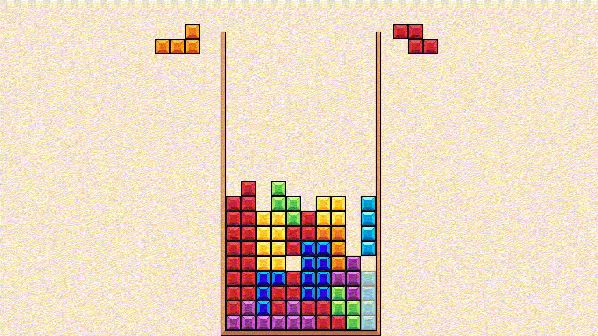

# Pixeltetris
A Tetris game written from scratch in C++ using the SDL2 development library. Apart from the core gameplay, the project also includes some extra features like a ghost block to reduce misdrops, a simple main menu, and support for multiple resolutions. All assets used were created by me.



## Gallery
  

## Installation
If you just want to play the game on your Windows machine, go the the releases page and get the latest executable. Note that you may need the [Microsoft Visual C++ Redistributables](https://support.microsoft.com/en-us/topic/the-latest-supported-visual-c-downloads-2647da03-1eea-4433-9aff-95f26a218cc0) if you don't have them already installed.

## Build Instructions
This is the first project where I use CMake to support multiple OSes and compilers, so to compile the game yourself you will need [CMake](https://cmake.org/overview/).

### Windows
- First of all you need Visual Studio to compile the game. I have only compiled with [Visual Studio Community](https://visualstudio.microsoft.com/vs/community/), but I assume that other versions work as well.
- Clone the repository to your machine using Visual Studio.
- You will also need the [SDL2](https://www.libsdl.org/download-2.0.php), [SDL_ttf 2.0](https://www.libsdl.org/projects/SDL_ttf/), and [SDL_image 2.0](https://www.libsdl.org/projects/SDL_image/) development libraries. Make sure to download the versions denoted with "Visual C++". Extract all zip files to the root directory of the repository you cloned.
- Open the project folder with Visual Studio.
- Select CMakeLists.txt in the root of the project to compile.
- You may need to change the *Build root* option in CMakeSettings.json from *${projectDir}\out\build\${name}* to *${projectDir}\build\${name}*, so that the font loads correctly.

### Linux
- Firstly, install the g++ compiler using a command like *sudo apt install g++* or *sudo dnf install gcc-g++*. Then, install CMake using a command like *sudo apt install cmake* or *sudo dnf install cmake*.
- You will also need the SDL2, SDL_ttf and SDL_image libaries. Install them on Ubuntu-based systems by running:
```
sudo apt install libsdl2-dev
sudo apt install libsdl2-ttf-dev
sudo apt install libsdl2-image-dev
```
or on Fedora-based systems by running:
```
sudo dnf install SDL2-devel
sudo dnf install SDL_ttf-devel
sudo dnf install SDL_image-devel
```
- Clone the repository to your PC.
- Open a terminal window in the root directory of the cloned repository and run these commands one by one:
```
mkdir build
cd build
cmake .
make
```
You will then find the Pixeltetris executable in build.

### MacOS
I do not have a MacOS machine so I cannot test any builds for that OS. However, the process of compilation should not be very different from that in Linux, since the CMake find files work in all OSes.

## Controls
- Left/Right/Down arrow keys: Move the tetromino
- Up arrow key: Rotate the tetromino
- Space: Hard drop tetromino
- Shift/C: Swap with hold block
- P: Pause the game
- Q/Esc: Go back

## Features to add
- ~~Create sprites for all objects~~
- ~~Add a hold block~~
- ~~Add a ghost block (the outline that shows the position of the piece if dropped)~~
- ~~Add a simple menu~~
- ~~Add an options menu~~
- ~~Add support for multiple resolutions~~
- ~~Add a pause menu~~
- ~~All done!~~

## Third party tools
- [SDL2 framework](https://www.libsdl.org/) to handle all the low-level stuff
- [SDL_ttf 2.0](https://www.libsdl.org/projects/SDL_ttf/) for rendering fonts
- [SDL_image 2.0](https://www.libsdl.org/projects/SDL_image/) for loading images
- The fonts I use are called [Munro](https://www.fontsquirrel.com/fonts/munro)
- [CMake scripts](https://github.com/tcbrindle/sdl2-cmake-scripts) to find SDL2, SDL_ttf, and SDL_image

## Acknowledgements
[Lazy Foo's SDL tutorials](https://lazyfoo.net/tutorials/SDL/index.php) have been extremely helpful, look into them if you are interested in low-level game programming or just want a framework to handle basic graphics for your C/C++ programs.

[An Introduction to Modern CMake](https://cliutils.gitlab.io/modern-cmake/) is great for learning the basics of CMake and avoiding bad practices.

[Javier Lopez's Tetris tutorial](https://javilop.com/gamedev/tetris-tutorial-in-c-platform-independent-focused-in-game-logic-for-beginners/#comments) was my initial inspiration for starting this project. I also use the same tricks he uses to make the management of the pieces and their rotations easier.

## License
The source code is licensed under the [MIT License](https://tldrlegal.com/license/mit-license). Note that the CMake find files and any fonts are NOT covered by the MIT license. They are distributed under seperate licenses that can be found in their respective folders. The Munro fonts are licensed under the [SIL Open Font License](http://scripts.sil.org/OFL).
